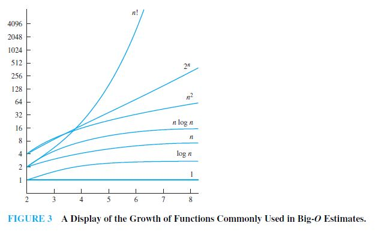

# dismathportfolio-JeremiahJacinto
dismathportfolio-JeremiahJacinto created by Classroom for GitHub

##Week1
- A proposition is a statement that is either true (1) or false (0).
- An axiom is a statement or proposition that is regarded as being established, accepted, or self-evidently true.

| Logical Symbol  |  Logical Operator     | Shorthand | Formula                                       | Logical Expression             |
| :-------------: |:---------------------:|:---------:|:---------------------------------------------:|:-----------------------------:|
| ¬               | Negation              | not       | val(¬p) = 1 - val(p)                          | ¬p                           |
| ∧               | Conjunction           | and       | val(p ∧ q) = min(val(p), val(q))              | p ∧ q                          
| v               | Disjunction           | or        | val(p v q) = max(val(p), val(q))              | p v q                        |
| ⊕              | Exclusive disjunction | xor       | if val(p)  not equal val(q) = 1 , otherwise  0|  p ⊕ q  ≡ (¬p ∧ q) v (p ∧ ¬q) |
| →               | Conditional           | if, then  | if val(p)  ≤ val(q) = 1 , otherwise  0        | p → q ≡  ¬p v q              |
| ↔               | Biconditional         | iff       | if val(p) equals val(q) = 1 , otherwise  0    |  p ↔ q ≡ (p → q) ∧ (q → p)    |

- Disjunction gets the Maximum 
- Conjuction gets tha minimum
- In getting truth table = 2^n Where n is the number of propositional variables

NOTE:
- Logic diagrams not included in exam
- Bitwise Operation included in exam

##Week2

- Argument - a sequence of statements that end with a conclusion.
- Valid - the conclusion, or final statement of the argument, must follow from the truth of the preceding statements, or premises, of the argument.
- Fallacy - common form of incorrect reasoning which lead to invalid arguments.
- Existential quantifier (∃x) - "there exist"
- Universal quantifier - (∀x) - "for all"

|                           Equivalence                           |         Name        |
|:-------------------------------------------------------------:  |:-------------------:|
|                      p ∧ T ≡ p   p v F ≡ p                   |    Identity laws    |
|                       p v T ≡ T   p ∧ F ≡ F                  |   Domination laws   |
|                       p v p ≡ p   p ∧ p ≡ p                  |   Idempotent laws   |
|                            ¬(¬p) ≡ p                            | Double negation law |
|                   p v q ≡ q v p   p ∧ q ≡ q ∧ p              |   Commutative laws  |
|       (p v q) v r ≡ p v (q v r)   (p ∧ q) ∧ r ≡ p ∧ (q ∧ r)  |   Associative laws  |
| p v (q ∧ r) ≡ (p v q) ∧ (p v r)    p ∧(q v r) ≡ (p ∧ q) v (p ∧ r) |  Distributive laws  |
|              ¬(p ∧ q) ≡ ¬p v ¬q   ¬(p v q) ≡ ¬p ∧ ¬q          |   De Morgan's laws  |
|                 p v (p ∧ q) ≡ p   p ∧ (p v q) ≡ p             |   Absorption laws   |
|                     p v ¬p ≡ T   p ∧ ¬p ≡ F                   |    Negation laws    |

MEMORIZE 
- p → q ≡  ¬p v q
- p ↔ q ≡ (p → q) ∧ (q → p)

NOTE:
 - ALWAYS CHECK THE ORDER OF PARENTHESIS
 
##Week3

|   Rule of Inference       |            Tautology           |          Name          |
|:--------------------:     |:------------------------------:|:----------------------:|
|       p p→q ∴q      |        (p ∧ (p → q)) → q       |      Modus ponens      |
|     ¬q p→q ∴ ¬p     |       (¬q ∧ (p → q)) → ¬p      |      Modus tollens     |
|     p→q q→r ∴p→r    |  ((p → q) ∧ (q → r)) → (p → r) | Hypothetical syllogism |
|      p∨q ¬p ∴q      |       ((p ∨ q) ∧ ¬p) → q       |  Disjunctive syllogism |
|       p ∴p ∨ q         |           p → (p ∨ q)          |        Addition        |
|       p ∧ q ∴p         |           (p ∧ q) → p          |      Simplication      |
|      p q ∴p ∧ q     |      ((p) ∧ (q)) → (p ∧ q)     |       Conjunction      |
| p ∨ q ¬p ∨ r ∴q ∨ r | ((p ∨ q) ∧ (¬p ∨ r)) → (q ∨ r) |       Resolution       |

##Week 4

Methods of Proof
1. Direct proof (p → q)
    - Assume p is T.
    - Show that q is also T.
2. Proof by contraposition (¬q → ¬p)
	 - Assume ¬q is T.
	 - Show that ¬p is also T.
3. Vacuous Proof (¬p → (p → q))
	 - Show that p is F
	 - p → q must be T.
4. Trivial Proof (q → (p → q))
	 - Show that q is T
	 - p → q is also T
	 
NOTE:
- Use Direct proof is p is more simple
- Use Contrapositive if p is complex

- Even number n = 2k
- Odd number n = 2k+1 / 2k -1

##Week5
5. Proof by contradiction
	 - Asuume that the premise is not T (¬premise ≡ T)
	 - Based on that, show that the premise will end up in a contradiction.   
6. Proof by Equivalence (p ↔ q = (p → q) ∧ (q → p)

NOTE:
- Proof by Contradiction : Apply Truth table in taking the negation of the premise.

##Week6
- You can disprove a theorem using counterexample.

Mathematical Induction
	    1. Basic step: Show P(1) ≡ T
	    2. Inductive step: 
	      - Assume P(k) is true.
	      - Show that is also P(k+1) true.

Prove P(n) = 1 + 2 + 3 + … + n = n(n+1)/2
	    - 1. Prove P(1) is true
	    - 2. Direct proof
	      - a. Assume P(k) ≡ T
	        - P(k) = 1 + 2 + 3 + … + k = k(k+1)/2
 	      - b. Show P(k + 1)
         - P(k + 1) = 1 + 2 + 3 + … + k + (k + 1) = (k+1)(k+2)/2
         
         Guide: P(k) = 1 + 2 + 3 + … + k = k(k+1)/2
         Substitute
	        - P(k + 1) = k(k+1)/2 + k + 1 =  (k+1)(k+2)/2
	        - P(k + 1) = (k+1)(k + 2)/2 =  (k+1)(k+2)/2
NOTE:
- Manipulate only 1 side.

##Week8
- Power set is the is the set of all subsets of S, including the empty set and S itself.
- Duplicate set elements = 1 count (Same set of money with Bill Gates)
- ∅ and {∅} NOT EQUAL!
- UNION - A ∪ B
	- consists of all element from sets A and B
- INTERSECTION - A ∩ B
	- consists of only common elements in sets A and B
- DIFFERENCE - A - B or A \ B
	- consists of elements from sets A and B but not their intersection
- SYMMETRIC DIFFERENCE - A ∆ B
	- consists of elements from sets A and B but not their intersection

- Union ∪ = And ∨
- Intersection ∩ = Or ∧

 **SET IDENTITIES TABLE**

|  **LAW**  |  **IDENTITY**  |
| :------: | :-----------------------------: |
|  Identity Laws  |  A ⋂ U ≡ A     A ⋃ ∅ ≡ A  |
|  Domination Laws  |  A ⋃ U ≡ U     A ⋂ ∅ ≡ ∅  |
|  Idempotent Laws  |  A ⋃ A ≡ A     A ⋂ A ≡ A  |
|  Complementation Law  |  (A¯)‾ ≡ A  |
|  Commutative Laws  |  A ⋃ B ≡ B ⋃ A     A ⋂ B ≡ B ⋂ A  |
|  Associative Laws  |  A ⋃ (B ⋃ C) ≡ (A ⋃ B) ⋃ C     A ⋂ (B ⋂ C) ≡ (A ⋂ B) ⋂ C  |
|  Distributive Laws  |  A ⋃ (B ⋂ C) ≡ (A ⋃ B) ⋂ (A ⋃ C)    A ⋂ (B ⋃ C) ≡ (A ⋂ B) ⋃ (A ⋂ C)  |
|  De Morgan's Laws  |  (A ⋂ B)‾ ≡ A‾ ⋃ B‾     (A ⋃ B)‾ ≡ A‾ ⋂ B‾  |
|  Absorption Laws  |  A ⋃ (A ⋂ B) ≡ A     A ⋂ (A ⋃ B) ≡ A  |
|  Complement Laws  |  A ⋃ A‾ ≡ U     A ⋂ A‾ ≡ ∅  |

- **Functions**
  - Let A and B be sets. A function f from A to B is an assignment of exactly one element of B to each element of A.
  - also called *mappings* or *transformations*.
- **Types of Functions**
    - **One - to - one Function (Injection)** - functions that never assign the same value to two different domain elements.
    - **Onto Function (Surjective)** - functions have equal range & co-domain.
    - **One - to - one Correspondence (Bijection)** - function is both one - to - one and onto.
- Domain
- Co-Domain

- NOTE: 
- int floor(float real)
- floor is the co domain
- real is the domain
- **NOT A FUNCTION**
- Write the final answer in the test questionaire clearly.

##Week9
- **Algorithms** - A finite set of precise instructions for performing a computation or for solving a problem.
- Properties of Algorithms.
- 1. Input - There should be an input.
- 2. Output - There should be an output.
- 3. Definite - It does not use english sentences; must be understood by all.
- 4. Correctness - Should produce correct output.
- 5. Finite - It should have finite number of steps.
- 6. General - It should use variables, and must be applicable to all problems of the same type.

- **Pseudocode** 
  - high-level desciption of an algorithm that uses the structural conventions of a programming language.
  - intended for human reading
  - **Preconditions** - statements that describe valid input.
  - **Postconditions** - conditions that the output should satisfy when the program has run.

- Linear Search:
	
		
		Input: S={A1,A2,...,An} A1 ∈ Z; x ∈ Z
		Output: index, loc where Aloc=x
		loc=-1
		for i; 1 to n
			if(Ai==x)
				loc=i;
		final assertion: loc is the location of element

- Binary Search:
		
		Input: {A1,A2,...An:distinct integers}
		i=1 (i is the left endpoint of the search interval)
		j=n (j is the right endpoint of the search interval)
		while i<j
			mid = [(i+j)/2]
			if x>A(mid) then i=mid+1
			else j=mid
		if x=Ai then location=i
		else location=-1
		return location 
- NOTE: 
- In quiz: Write
- Procedure:
- Input:
- Output:
- Pseudocode:
- Page Rank #1 Algorithm

##Week10
- **BINARY SEARCH PSEUDOCODE** 
    - comparison of the middle values of a list until the desired output is found.
- **SORTING ALGORITHMS**
    - problem of assorting elements into increasing order
- **BUBBLE SORT** 
    - compares the first two elements then interchanging them if they are in the incorrect order
- **INSERTION SORT**
    - compares the second element with the first and inserts it before the first element if it is less
    - Otherwise, it is inserted after the first element.
- **GREEDY ALGORITHMS** 
    - selects the best choice at each step, instead of considering all sequences that may lead to an optimal solution
    - applied in optimization problems where a solution to the given problem either minimizes or maximizes the value of some parameter

##Week11:
- Growth of functions approximation:
    1. Big O Notation
    2. Big Theta Notation
    3. Big Omega Notation
- Big-O notation ( check only upper bound ): |a(x)| <= C|b(x)| where x>k, wherein a and b are functions, and C is a constant multiplied to a function to check whether it would overtake at a certain value or not. 
- Big-Omega notation ( check only lower bound ): C|g(x)| <= |f(x)| where x>k.
- Big-Theta notation ( check both lower bound and upper bound ): C|g(x)| <= |f(x)| <= C|g(x)|- -

- **Algorithm Time Complexity** - the number of comparisons used would serve as the number of the time complexity.

|                             Complexity                               |        Terminology     |
|:--------------------------------------------------------------------:|:----------------------:|
|                       Θ(1)                                           |Constant Complexity     |
|                       Θ(logn)                                        |Logarithmic Complexity  |
|                       Θ(n)                                           |Linear Complexity       |
|                       Θ(nlogn)                                       |nlogn Complexity        |
|                       Θ(n^b)                                         |Polynomial Complexity   |
|                       Θ(b^n), where b>1                              |Exponential Complexity  |
|                       Θ(n!)                                          |Factorial Complexity    |

- NOTE: 
- Find C and K to be proofs of Big Omega, Big O and Big theta
- Equate the function to the notation to get C (x^2 +2x +1 = Cx^2)
- Possible test question in final exam

##Week 12
- **Graph Theory**
- **Graph** - discrete structures consisting of vertices and edges that connect these vertices.
- A graph G = (V,E) consists of V, a nonempty set of *vertices* (or nodes) and E, a set of *edges*. Each edge has either one or two vertices associated with it, called its *endpoints**.
- Applications
  - Networks (LAN, MAN, Social Networks, etc.)
  - Job assignments
  - Representing computational models
  - Developing a bot to retrieve info off www

- **Hand shaking theory**
    2e = ∑deg(v)

- *Path* - sequence of edges that begins at a vertex of a graph and travels from vertex to vertex along edges of the graph.
- *Euler Circuit* - a simple circuit containing every edge of a graph. (All vertices have an even number of degree)
- *Euler Path* - simple path containing every edge of a graph. (Exactly 2 vertices have an odd number of degree)
- *Hamilton Path* - a simple path that passes through every vertex exactly once.
- *Hamilton Circuit* - a simple circuit that passes through every vertex exactly once which ends up in the same place in which it began.

- **Isomorphism of Graphs** 
  - a simple graph is isomorphic if it has a one-to-one and onto function.
  - i.e. vertices change positions and still have the same connection as before.

- **Planar Graph**
  - Graphs that can be drawn in the plane without edges having to cross.
  - Euler's Formula: r = e - v + 2
    - r - regions
    - e - edges
    - v - vertices
  - Euler's Characteristic: ℵ = r - |e| + |v| where ℵ = 2

- **Homeomorphic Graphs**
  - Graphs are called homeomorphic if they can be obtained from the same graph by a sequence of elementary subdivisions.
  - *Elementary Subdivision* - If a graph is planar, so will be any graph obtained by removing an edge and adding a new vertex together with edges.
  - *Kuratowski's Theorem* - a graph is nonplanar if and only if it contains a subgraph homeophobic to K3,3 and K5.

- Note:
- Adjacency Graph: Put 1 if connected and 0 if not.
- Hard Planar and non-Planar question on quiz (10 nodes)
- Apply KISS(Keep it simple stu***!)
- Kn = Complete connection of nodes
- n = number of nodes

##Week13
-**Graph Coloring**
- minimal use of color
- assignment of a color to each vertex
- **Chromatic number** - least colors needed for a coloring of graph

-**Four Color Theorem**
- Applies to planar graphs only
- **Trees**
  - A connected undirected graph with no simple circuits.
  - A data structure that emulates a heirarchical tree structure with a set of linked nodes.
  - Used to construct efficient algorithms for locating an item in a list.
  - Multiple *Trees* are called **Forest**.
  - *Rooted Tree* - a tree in which one vertex has been designated as the root and every edge is directed away from the root.
    - Root - the beginning of a tree
    - Internal vertices - every vertex before the leaves
    - Leaves - vertices with no descendants
  - *M-ary tree*
    - A rooted tree is called an m-ary tree if every internal vertex has no more than m children.
    - An m-ary tree with m = 2 is called a *binary tree*
-  **A full m-ary tree:**
- n vertices has i=(n-1)/m internal and l=[(m-1)n+1]/m leaves
- i internal vertices has n=mi+1 vertices and l=(m-1)i+1
- l leaves has n=(ml-1)/(m-1) internal vertices

-Ordered rooted tree
- rooted tree where the children of each internal vertex are ordered.

- **Modeling Computations**
  - *Language and Grammars*
    - Grammars - used to generate the words of a language and to determine whether a word is in a language
    - Compiler - reads a program written in a source language and translate it into an equivalent program in a target language.
      - Formal Language - automatic translation of one language to another
        - well defined set of rules

- **Alphabet & String**
    - common way to talk about words, numbers, etc.

- **Automata Theory**
    - Studies the law of computation
    - Finite Automata - simplest model of automata
      - initial state
      - final state
      - dead/stuck state
      - transition state

- **Lexical Analysis**
    - process where the stream of characters making up the source program into a sequence of "words" that make up the source code.

- **Finite State Machine**
  - S: Finite set of states
  - I: Finite input alphabet
  - O: Finite output alphabet
  - f: Transition function
  - g: Output function
  - s0: Initial state

- **Turing Machine**
    - Alan Turing, the father of computer science.
    - "Imitation Game" movie based on his life.
- NOTE:
- Coloring Graphs Even = 2 colors Odd = 3 If have centers = +1
- Trees possible final project
- Focus on last topics for finals
- Reading assignments
